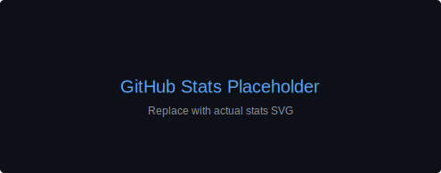
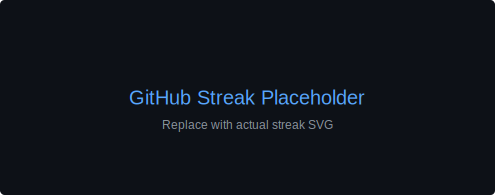

# 👋🏾 Hi, I'm Benjamin Monroe

💼 **Associate Project Engineer** at [World Wide Technology](https://www.wwt.com)  
🎓 **Bachelor's in Cloud Computing (In Progress)**  
☁️ Future **Cloud Security Engineer**  
🎧 **Pro Tools Engineer / Music Producer** (10+ years)  
🔐 **TryHackMe Top 3% | Lifelong Learner**

---

## Table of Contents
- [Connect With Me](#-connect-with-me)
- [Current Focus](#-current-focus)
- [Music Production & Audio Engineering](#-music-production--audio-engineering)
- [Certifications & Badges](#-certifications--badges)
- [Tech & Tools](#-tech--tools)
- [GitHub Stats & Activity](#-github-stats--activity)
- [Support My Work](#-support-my-work)
- [Contributing / Contact](#-contributing--contact)

---

## 🌍 Connect With Me

---

## ⚙️ Current Focus
- 🌩 Building **cloud-native security projects** on AWS, Azure, and GCP
- 🔧 Learning **DevSecOps**, IaC with Terraform, Docker, and Ansible
- 🧠 Exploring **AI for cybersecurity** and digital automation
- 🚀 Growing [**DigitalRichKid.com**](https://digitalrichkid.com) – AI-driven digital wealth ecosystem
- 🧱 Developing [**MOAISecurity.com**](https://moaisecurity.com) – AI security & trust technology
- 🌐 Building my personal brand at [**BenMonroe.ai**](https://benmonroe.ai)

---

## 🎵 Music Production & Audio Engineering

With **10+ years** of experience as a **Pro Tools Certified Engineer** and Music Producer, I've honed my craft in:

- 🎛️ **Mixing & Mastering** across multiple genres
- 🎚️ **Studio Production** with Pro Tools, Logic Pro, and industry-standard plugins
- 🎤 **Recording Engineering** for vocals, instruments, and live sessions
- 🎼 **Sound Design** for music, podcasts, and multimedia projects

My dual expertise in **technology and music** gives me a unique perspective on creative problem-solving and attention to detail.

🎧 **Check out my beats and production services:** [BuySomeBeats.com](https://buysomebeats.com)

---

## 🎓 Certifications & Badges

  

---

## 💻 Tech & Tools

### ☁️ Cloud Platforms

### 🔧 DevOps & Infrastructure as Code

---

## 📊 GitHub Stats & Activity

  
  

  

---

## 🏆 GitHub Trophies (static)

  

---

## 🔥 Profile Activity (static)

  

  

  

---

## 📝 Latest Blog Posts & Articles

<!-- BLOG-POST-LIST:START -->
_Coming soon! Stay tuned for articles on cloud security, DevSecOps, and AI-driven automation._
<!-- BLOG-POST-LIST:END -->

---

## ☕ Support My Work

If you find my projects helpful or want to support my work in cloud security and open source:

---

## 🤝 Contributing / Contact
- PRs are welcome — feel free to open issues for suggestions or improvements.
- For collaborations, client work, or music production: connect via LinkedIn or email (listed on my profile).

_Last updated: 2025-12-10_